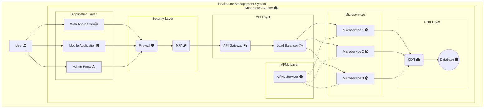

# Med Service

## Architecture

```mermaid
flowchart
    subgraph "Healthcare Management System"
        User[User fa:fa-user]
        
        subgraph "Kubernetes Cluster fa:fa-cubes"
            subgraph "Application Layer"
                WA[Web Application fa:fa-globe]
                MA[Mobile Application fa:fa-mobile]
                AP[Admin Portal fa:fa-user-md]
            end
            subgraph "Security Layer"
                FW(Firewall fa:fa-shield)
                MFA(MFA fa:fa-key)
            end
            subgraph "API Layer"
                API(API Gateway fa:fa-cogs)
                LB(Load Balancer fa:fa-balance-scale)
            end
            subgraph "Data Layer"
                DB((Database fa:fa-database))
                CDN(CDN fa:fa-cloud)
            end
            subgraph "AI/ML Layer"
                AI(AI/ML Services fa:fa-brain)
            end
            subgraph "Microservices"
                MS1[Microservice 1 fa:fa-cube]
                MS2[Microservice 2 fa:fa-cube]
                MS3[Microservice 3 fa:fa-cube]
            end
        end
        
    end
    User --> WA
    User --> MA
    User --> AP
    WA --> FW
    MA --> FW
    AP --> FW
    FW --> MFA
    MFA --> API
    API --> LB
    LB --> MS1
    LB --> MS2
    LB --> MS3
    MS1 --> CDN
    MS2 --> CDN
    MS3 --> CDN
    CDN --> DB
    AI -.- MS1
    AI -.- MS2
    AI -.- MS3
```
